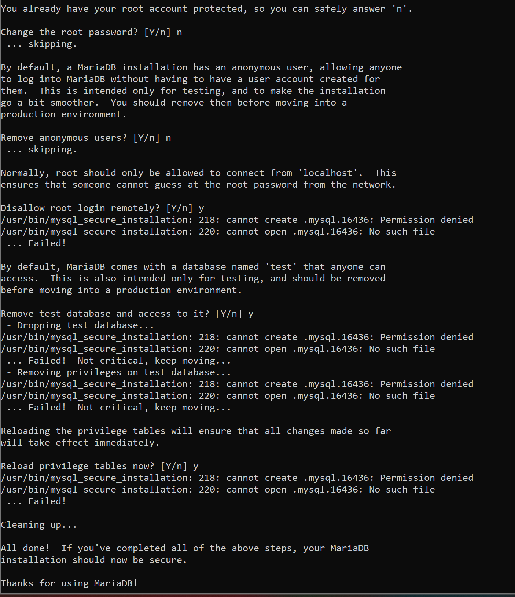
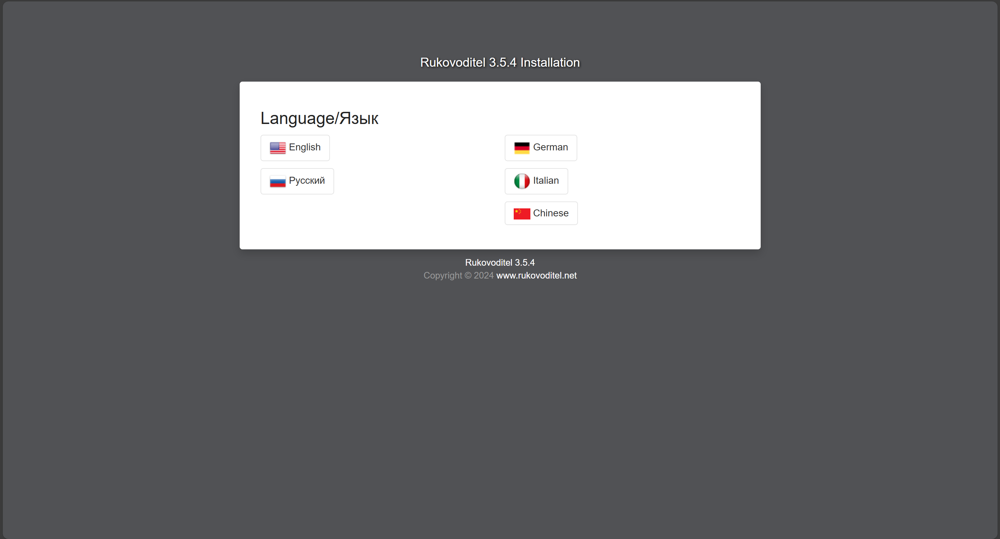

<p align="center">
  
</p>


| [Sekilas Tentang](#sekilas-tentang) | [Instalasi](#instalasi) | [Cara Pemakaian](#cara-pemakaian) | [Pembahasan](#pembahasan) | [Referensi](#referensi) |
|------------------------------------|-------------------------|-----------------------------------|--------------------------|------------------------|

# Aplikasi Web "Rukovoditel"
[^ kembali ke atas ^](#top)


Tugas Projek sesi UTS mata kuliah Komdat kelompok 6, Dapat diakses di

## Sekilas Tentang
[^ kembali ke atas ^](#top)

Rukovoditel adalah aplikasi open source yang bisa diinstal di server lokal atau server internet yang mendukung PHP/MySQL. Proyek ini terdiri dari dua bagian: bagian utama yang gratis dan Ekstensi. Di bagian utama, Rukovoditel menyediakan berbagai alat yang memudahkan Anda untuk merancang dan mengatur aplikasi sesuai kebutuhan. Sedangkan, Ekstensi menawarkan fitur tambahan seperti laporan dan alat yang lebih canggih untuk mendukung perencanaan dan manajemen yang lebih optimal.

Rukovoditel pertama kali dirilis pada November 2014 dan dilisensikan di bawah GNU GPLv3. Aplikasi ini ditulis dalam bahasa pemrograman PHP dan sudah dioptimalkan untuk perangkat mobile. Rukovoditel juga mendukung LDAP untuk otentikasi, tersedia dalam berbagai bahasa, serta mampu menampilkan teks dalam arah kanan ke kiri (RTL), menjadikannya fleksibel dan dapat digunakan oleh beragam pengguna dari berbagai penjuru dunia.

## Instalasi
[^kembali ke atas^](#top)

### Persyaratan Sistem
- **PHP** 8.0+
- **MariaDB** 10.3+ atau **MySQL** 5.7+
- **Apache** Web Server
- **Linux** atau **Windows** OS

Install seluruh paket dan pastikan sistem telah terupdate
```
    $ sudo apt-get update
    $ sudo apt-get install apache2
    $ sudo apt-get install mariadb-server -y
    $ sudo apt-get install php libapache2-mod-php php-mysql php-zip -y
    $ sudo apt-get install php-gd php-mcrypt php-mbstring php-xml php-ssh2 php-curl php-zip php-intl
    $ sudo apt-get install unzip
```

### Proses Instalasi
1. Download dan Ekstrak Rukovoditel
```
wget https://sourceforge.net/projects/rukovoditel/files/rukovoditel_3.5.4.zip
unzip rukovoditel_3.5.4.zip
```

2. Buat Database untuk Rukovoditel
Amankan instalasi MySQL dengan perintah berikut:
```
    sudo mysql_secure_installation
```

Masuk ke MySQL dan buat data base baru
```
    mysql -u root -p
    CREATE DATABASE rukovoditel;
```

Beri hak akses untuk pengguna pada database yang baru dibuat:
```
    GRANT ALL PRIVILEGES ON rukovoditel.* TO 'user'@'localhost' IDENTIFIED BY 'password';
    FLUSH PRIVILEGES;
    EXIT;
```

3. Aktifkan modul rewrite pada Apache
```
    sudo a2enmod rewrite
    sudo service apache2 restart
```

4. Cek IP Address Lokal
```
    ifconfig
```
Pindahkan folder rukovoditel ke direktori `/var/www/html/`
```
    sudo mv rukovoditel/ /var/www/html/rukovoditel/
```

5. Konfigurasi Permission
Berikan hak akses kepada pengguna www-data untuk direktori rukovoditel
```
    chown www-data:www-data -R /var/www/html/rukovoditel/
    sudo touch /etc/apache2/sites-available/rukovoditel.conf
    sudo ln -s /etc/apache2/sites-available/rukovoditel.conf /etc/apache2/sites-enabled/rukovoditel.conf
```
Edit file konfigurasi tersebut
```
    sudo nano /etc/apache2/sites-available/rukovoditel.conf
```
Isi file konfigurasiberikut:
```
    <VirtualHost *:80>
        ServerAdmin admin@ubuntu
        DocumentRoot /var/www/html/rukovoditel
        ServerName [IP-ADDRESS]
        ServerAlias ubuntu

        <Directory /var/www/html/rukovoditel/>
            Options Indexes FollowSymLinks
            AllowOverride All
            Require all granted
        </Directory>

        ErrorLog ${APACHE_LOG_DIR}/error.log
        CustomLog ${APACHE_LOG_DIR}/access.log combined
    </VirtualHost>
```
Aktifkan konfigurasi dan restart Apache
```
    sudo ln -s /etc/apache2/sites-available/rukovoditel.conf /etc/apache2/sites-enabled/rukovoditel.conf
    sudo service apache2 restart
```

6. Uji Apilkasi dan Upload ke dalam CPanel pada VPS
Uji dengan membuka browser dan ketikkan alamat IP server
```
    http://[IP-ADDRESS]/rukovoditel/
```

Aplikasi berjalan dengan baik

7. Konfigurasi Rukovoditel pada VPS
- Upload file rukovoditel ke dalam CPanel


- Import database ke dalam CPanel


- Buka aplikasi Rukovoditel
- Pilih Bahasa yang akan digunakan
- Konfigurasi Database


- Tambahkan nama, admin user dibagian MySQL database ini. Setelah selesai setting database, kita lanjutkan proses intalasi


- Setelah selesai, tampilan website akan berubah seperti berikut


## Cara Pemakaian
[^ kembali ke atas ^](#top)

- Tampilan aplikasi web
- Fungsi-fungsi utama
- Isi dengan data real/dummy (jangan kosongan) dan sertakan beberapa screenshot
- Tampilan Dasboard Rukovoditel

- Tampilan Pada bagian Project 

- Tampilan Bagian User 

- Tampilan bagian add new project 


  


## Pembahasan
[^ kembali ke atas ^](#top)

Rukovoditel adalah aplikasi manajemen proyek open-source yang memungkinkan pengguna untuk mengatur proyek dan tugas dengan cara yang fleksibel. Aplikasi ini didesain dengan modularitas, memungkinkan penambahan berbagai fitur sesuai kebutuhan, baik di lingkungan server lokal maupun server internet.


**Kelebihan:**
1. Open-source: Rukovoditel dapat digunakan tanpa biaya lisensi, menjadikannya terjangkau bagi organisasi kecil.
2. Fleksibel dan Kustomizable: Pengguna bisa mengatur modul, bidang, dan alur kerja sesuai kebutuhan.
3. Fitur Otomatisasi: Memungkinkan otomatisasi seperti backup database dan skrip shell untuk pemeliharaan rutin.
4. Ekstensi Fitur: Ada opsi untuk menambah fitur dengan ekstensi, seperti pelaporan yang lebih canggih dan alat perencanaan tambahan.
   
   
**Kekurangan:**
1. Antarmuka Pengguna Sederhana: Tampilan dasar antarmuka terlihat kurang modern dan kurang intuitif dibandingkan aplikasi komersial.
2. Dukungan Terbatas: Karena bersifat open-source, pengguna mungkin kesulitan menemukan bantuan teknis kecuali melalui komunitas pengguna atau forum.
3. Keterbatasan di Versi Gratis: Fitur lanjutan, seperti pelaporan terperinci, hanya tersedia melalui ekstensi berbayar.
   
   
**Perbandingan dengan Aplikasi Lain:**
1. Trello: Trello lebih mudah digunakan dan memiliki tampilan yang lebih sederhana, tetapi tidak sefleksibel Rukovoditel dalam hal pengaturan alur kerja.
2. Asana: Lebih unggul dalam hal desain modern dan fitur kolaborasi yang kuat, tetapi berbayar untuk fitur-fitur premium.
3. Jira: Lebih kaya fitur terutama untuk proyek pengembangan perangkat lunak, tetapi lebih kompleks dan membutuhkan biaya tinggi.
4. Redmine: Sama-sama open-source, tetapi Rukovoditel lebih unggul dalam hal kemudahan penggunaan dan fitur kustomisasi.

Rukovoditel adalah aplikasi yang cocok untuk organisasi yang membutuhkan solusi manajemen proyek yang terjangkau dan fleksibel. Meski antarmuka dan dukungannya terbatas, kustomisasi yang luas dan opsi ekstensi menjadikannya pilihan menarik dibandingkan aplikasi sejenis lainnya.

## Referensi
[^ kembali ke atas ^](#top)

- [DOCUMENTATION](https://www.rukovoditel.net/)
- [RUKOVODITEL SELF-HOSTING](http://hexakomdat.my.id/rukovoditel/)
- [TRELLO](https://trello.com/)
- [ASANA](https://asana.com/id)
- [JIRA](https://jira.atlassian.com/)
- [REDMINE](https://www.redmine.org/)
